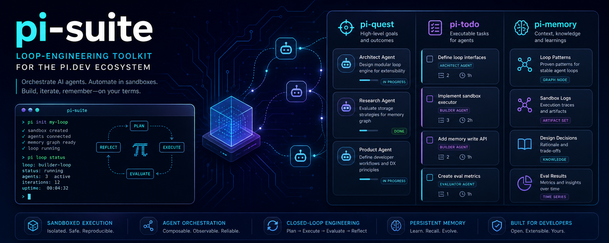

# pi-suite



A loop-engineering toolkit for [pi](https://pi.dev) — three extensions, previously
maintained as separate repos, now consolidated here behind one cross-extension contract:

| Extension     | Role                                                                                                                                 |
| ------------- | ------------------------------------------------------------------------------------------------------------------------------------ |
| **pi-quest**  | Proactive AI project manager — plans, delegates to sub-agents, verifies, tracks git, and applies sandbox/policy guidance for tasks.  |
| **pi-todo**   | Persistent task ledger with sub-agent delegation.                                                                                    |
| **pi-memory** | Persistent project & user memory — tech-stack detection, conventions, structured facts, quest research, and sub-agent model choices. |

They were built to work together (quest syncs tasks into todo and conventions/research
into memory). Consolidating them into one repo makes that relationship explicit: a single
shared [`core/`](core/README.md) module owns the storage contract, so the three can no
longer drift apart silently. The standalone `pi-quest`, `pi-todo`, and `pi-memory` repos
are now deprecated in favor of this suite.

## Feature-to-tool map

Every headline claim maps to concrete tools or commands you can use today. "pi loop" and
"pi init" are **illustrative names** for the loop-engineering concept (design → research →
build → evaluate), not separate CLI commands — they live as the `loop-engineering` team
config and the quest auto-pilot loop.

| Capability                | Delivered by                                                                                                                                                                                              |
| ------------------------- | --------------------------------------------------------------------------------------------------------------------------------------------------------------------------------------------------------- |
| **Plan & delegate**       | `quest_create` → `quest_plan` → `quest_approve` → auto-pilot steps via pi-minions `subagent` (guarded `quest_delegate` fallback for sandboxed steps)                                                      |
| **Auto-pilot loop**       | Quest runtime (`register-events.ts`) fires pending steps, delegates sub-agents, verifies results, and escalates model rungs on failure                                                                    |
| **Model ladder**          | `quest_assign_ladder` approves an ordered cheap→frontier rung list; verified failures escalate automatically (see [Verified escalation ladder](#verified-escalation-ladder))                              |
| **Loop-engineering team** | Built-in `loop-engineering` team: architect (planner) → research (scout) → product + builder (worker) → evaluator (verifier). Use `quest_team` to list; pass `team: "loop-engineering"` to `quest_create` |
| **Sandbox / policy**      | `quest_create(sandbox: { mode, allowedPaths, allowCommands, … })` — policy enforced at the tool-call boundary (see [Quest sandbox](#quest-sandbox))                                                       |
| **Task ledger**           | `todo_write` with delegation; `/todo` command; quest steps synced as todo items                                                                                                                           |
| **Memory & conventions**  | `memory_status`, `memory_project`, `memory_user`; `/memory` command; auto-detected tech stack + saved conventions                                                                                         |
| **Memory graph**          | `memory_graph` — list/add/link/remove typed nodes (loop-pattern, sandbox-log, artifact-set, design-decision, knowledge, eval-result) and edges on the project knowledge graph                             |
| **Eval time-series**      | `quest_eval_stats` — reads the append-only eval JSONL trail and renders a per-day table of pass rates, average durations, and model-ladder escalations                                                    |
| **Git tracking**          | `quest_commit` to record per-step commits; `quest_git_summary` for a PR-ready change log with auto-branch and auto-PR hints                                                                               |
| **Research memory**       | `quest_memory_save` stores findings keyed by topic; mirrored to project memory for cross-quest awareness                                                                                                  |
| **Decision points**       | `quest_decide` presents tradeoff options to the user during planning or execution                                                                                                                         |
| **Kanban board**          | `/quest` or `/quest kanban` opens a keyboard-driven TUI; navigate columns, inspect steps, retry failures                                                                                                  |

## Full tool reference

Every registered tool and the extension that owns it. Headline claims map to these;
the full set gives you status checks, history browsing, search, linting, and step-level
inspection.

### Quest (pi-quest)

| Tool                  | Purpose                                                       |
| --------------------- | ------------------------------------------------------------- |
| `quest_create`        | Create a new quest from a goal                                |
| `quest_plan`          | Save a step breakdown; replace all existing steps             |
| `quest_approve`       | Approve pending plan and start execution                      |
| `quest_decide`        | Ask the user a tradeoff question (branch, ambiguity)          |
| `quest_update`        | Mark a step done/failed/skipped with a result summary         |
| `quest_delegate`      | Legacy guarded fallback for sandboxed Quest steps             |
| `quest_assign_model`  | Approve a role's model and optional thinking level            |
| `quest_assign_ladder` | Propose a cheap→frontier model ladder for execution roles     |
| `quest_status`        | Show current quest, steps, and progress                       |
| `quest_task_detail`   | Full detail for one step (context, result, attempts, timing)  |
| `quest_step_detail`   | Alias for `quest_task_detail` (prefer `step` naming)          |
| `quest_history`       | Browse recently completed quests                              |
| `quest_abort`         | Permanently archive and clear the current quest               |
| `quest_commit`        | Record a git commit as a deliverable for a step               |
| `quest_git_summary`   | PR-ready change log with auto-branch/auto-PR hints            |
| `quest_team`          | List available team configs                                   |
| `quest_memory_save`   | Save a research finding keyed by topic                        |
| `quest_eval_stats`    | Daily time-series table of pass rates, durations, escalations |

### Todo (pi-todo)

| Tool           | Purpose                                        |
| -------------- | ---------------------------------------------- |
| `todo_write`   | Replace full task list; delegate to sub-agents |
| `todo_history` | Browse archived todo lists for this project    |

### Memory (pi-memory)

| Tool             | Purpose                                                 |
| ---------------- | ------------------------------------------------------- |
| `memory_status`  | Show what pi knows about this project and your prefs    |
| `memory_project` | View/update project conventions, facts, and tech fields |
| `memory_user`    | View/update per-user preferences and conventions        |
| `memory_search`  | Search conventions and facts by keyword                 |
| `memory_lint`    | Audit memory for duplicates, empties, oversize entries  |
| `memory_graph`   | Manage typed knowledge graph nodes and edges            |

## Demo


```text
/quest create  →  plan steps  →  delegate agents  →  verify  →  recap
```

When a quest finishes, `pi-quest` archives the active quest, clears its synced todo
items, and posts a compact recap with the scorecard, step results, git commits, saved
conventions, and next action.

## Layout

```
pi-suite/
├── core/                  # shared cross-extension contract + *.test.ts
│   ├── contract.ts        #   JSON types, CONTRACT_VERSION
│   ├── paths.ts / hash.ts #   ~/.pi/agent path helpers, cwdHash
│   ├── fs.ts              #   readJSON / writeJSON / updateJSON / appendLine
│   ├── session-meta.ts    #   shared status handoff between extensions
│   ├── retry-policy.ts    #   retry/burst/depth constants (one source of truth)
│   ├── run-ledger.ts      #   append-only JSONL execution log per quest
│   ├── eval-logging.ts    #   per-task eval audit trail (JSONL)
│   └── eval-stats.ts      #   aggregated pass rates + daily time-series from eval logs
├── extensions/
│   ├── quest/             # pi-quest   → extensions/quest/index.ts
│   │   ├── context-broker.ts  #   composable sub-agent prompt builder
│   │   ├── sandbox.ts        #   sandbox policy resolution + worktree helpers
│   │   ├── sandbox-guard.ts  #   per-call tool-call enforcement (bash/edit/write)
│   │   └── verifier.ts       #   structured verification loop + sandbox compliance checks
│   ├── todo/              # pi-todo    → extensions/todo/index.ts
│   └── memory/            # pi-memory  → extensions/memory/index.ts
├── docs/                  # architecture & design notes
├── tsconfig.json          # one typecheck gate over core + all extensions
└── .prettierrc.json       # one formatting convention for the whole suite
```

Each extension imports the shared contract from `core/` via a relative path
(`../../core`) — there is nothing to publish. The pi host packages
(`@earendil-works/pi-*`, `typebox`) are declared as `peerDependencies` (provided
by the pi runtime at load) and pinned as `devDependencies` so `tsc` checks real
API usage rather than `any` stand-ins.

## Quest sandbox

`pi-quest` includes a sandbox/policy layer for safer agent loops. It is **not** an
OS-level sandbox — there is no kernel, container, or filesystem isolation. Enforcement
happens at pi's tool-call boundary. Be precise about what that means:

**Enforced** (a violating call is blocked before it runs):

- **Tool scope.** Read-only roles (planner, scout, reviewer, verifier) get read-only
  tools; worker roles get write/shell tools, gated by policy.
- **Orchestrator tool calls.** pi's `tool_call` event hook (`register-events.ts`) runs
  `sandbox-guard.ts` `evaluateToolCall` against every bash/edit/write the main agent
  makes. It returns `{ block: true, reason }` for a denied path, a
  destructive/network/package-install command, a denied-command pattern, or a
  path/command outside an allow-list in restricted/isolated mode.
- **Sandboxed sub-agent tool calls.** A guarded fallback sub-agent's isolated session loads
  no extensions, so the `tool_call` hook never fires inside it. The fallback spawn path (`subagent.ts`)
  disables built-in tools (`noTools: "builtin"`) and supplies **guarded** tool
  definitions — bash/edit/write wrapped with the same `evaluateToolCall` guard — so the
  same policy is enforced per call rather than denying file work outright.
- **Sensitive files.** Built-in deny globs for secrets, keys, credentials, and env files
  are always enforced for write/edit, on top of the quest's `deniedPaths`.

**Isolated mode** (worktree isolation):

- In `isolated` mode, real git worktrees are created per delegation via
  `sandbox.ts` (`createWorktree`). The sub-agent runs inside the worktree directory, and
  worktrees are cleaned up after the step completes. Worktree metadata plus sandbox
  artifacts (touched paths, changed files, commit hash) are recorded on the step's
  `sandboxArtifacts` field.

**Advisory** (guidance and after-the-fact review, not a hard boundary):

- Policy constraints injected into sub-agent prompts.
- Verifier compliance checks added to verification handoffs.

Quest-level `sandbox` policy and per-step overrides drive all of the above (overrides can
only tighten, never loosen). Sandbox status is surfaced in quest status, kanban, and step
detail views. In `isolated` mode, pass `worktree` to `quest_create(sandbox: { … })` to
configure the base branch and worktree path.

Unsandboxed auto-pilot steps use pi-minions' `subagent` tool and pass the approved model,
thinking level, and current ladder rung as per-invocation overrides. Restricted and isolated
steps stay on `quest_delegate` because pi-minions does not yet enforce Quest's sandbox policy.

## Minion model and thinking assignment

`quest_assign_model` stores a project-scoped role assignment in
`ProjectMemory.agentModels`. Assignments are additive and backward-compatible: old entries
with only `model` still use pi's default/tier thinking, while new entries may include
`thinkingLevel` (`off`, `minimal`, `low`, `medium`, `high`, or `xhigh`). Example:

```text
quest_assign_model(role="worker", proposed="gpt-5.6-sol", thinkingLevel="medium")
```

The normal Quest steering path then requests:

```text
subagent(agent="worker", task="…", model="gpt-5.6-sol", thinking="medium")
```

## Verified escalation ladder

Quest can spend cheap tokens first without lowering the quality bar. The user approves an
ordered cheap→frontier model ladder once per project (`quest_assign_ladder` →
`ProjectMemory.modelLadder`). Ladder-eligible execution steps start on the cheapest viable
rung; the existing verifier remains the gate. A verified failure retries on the same rung
with a compact failure brief, then escalates to the next rung only after that rung's retry
budget is exhausted.

The ladder is adaptive: `core/eval-stats.ts` reads prior eval JSONL and computes
per-(role, model) verified pass rates. `pickStartRung` skips a rung only after enough
samples prove it underperforms; with no history, the cheapest rung is trusted. No default
rung list ships — hard-coded model catalogs rot. The feature is inert until a project
approves a ladder.

## Eval time-series

The per-task eval audit trail (`core/eval-logging.ts`) records every terminal step outcome
(done/failed/skipped, verified status, duration, escalations, model). `core/eval-stats.ts`
reads that trail and produces two views:

- **Per-role/model pass rates** (`computeEvalStats`) — powers the adaptive ladder start-rung
  choice.
- **Daily time-series** (`computeEvalTimeSeries`) — exposed via `quest_eval_stats`: a
  markdown table of per-day pass rates, average step durations, and total model-ladder
  escalations, so you can spot trends over time.

## Memory knowledge graph

`memory_graph` (`list | add | link | remove`) manages a typed knowledge graph on the
project memory profile (`ProjectMemory.graph`). Nodes carry a kind
(loop-pattern, sandbox-log, artifact-set, design-decision, knowledge, eval-result) and
edges are directed links (supports, produced, derived-from, supersedes, relates-to). The graph is
additive — it never replaces existing memory fields — and is preserved across rescans
alongside quest research and model choices.

## Why one repo

`pi`'s installer reads the **root** `package.json` of a git source and loads every
entry in its `pi.extensions` array. So one repo can ship all three extensions, and a
single `pi install` pulls them together — while `pi config` still lets a user disable any
one of them. A monorepo is therefore a first-class, `git:`-installable unit. The
alternative (three repos sharing a published `core` package) is only needed for
independent npm installation, which `pi`'s `git:` route cannot do for a subdirectory.

See [docs/architecture.md](docs/architecture.md) for the full rationale and the
evidence from `pi`'s package manager.

## Install

Install all three extensions together with a single command:

```bash
pi install git:github.com/dvictor357/pi-suite
```

To run just one extension, install the suite and disable the others with `pi config`.

## Develop

```bash
npm install        # dev tooling: typescript, prettier, tsx, pi host types
npm run typecheck  # tsc --noEmit over core + all extensions (against real pi types)
npm test           # node:test via tsx — core + extension test suites
npm run format     # prettier --write (tabs; see .editorconfig / .prettierrc.json)
```

CI runs `typecheck`, `test`, and `format:check` on every push and PR.

## Status

All three extensions have been migrated in from their standalone repos onto the shared
`core/` contract; those repos are now deprecated and archived. See
[MIGRATION.md](MIGRATION.md) for the migration record.

## License

MIT
