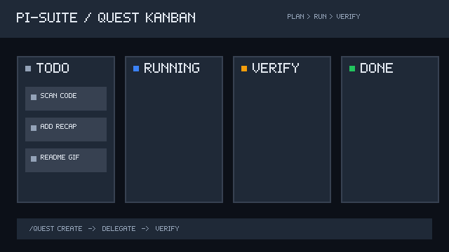

# pi-suite

A loop-engineering toolkit for [pi](https://pi.dev) — three extensions, previously
maintained as separate repos, now consolidated here behind one cross-extension contract:

| Extension     | Role                                                                                                                                 |
| ------------- | ------------------------------------------------------------------------------------------------------------------------------------ |
| **pi-quest**  | Proactive AI project manager — plans, delegates to sub-agents, verifies, tracks git, and applies sandbox/policy guidance for tasks.  |
| **pi-todo**   | Persistent task ledger with sub-agent delegation.                                                                                    |
| **pi-memory** | Persistent project & user memory — tech-stack detection, conventions, structured facts, quest research, and sub-agent model choices. |

They were built to work together (quest syncs tasks into todo and conventions/research
into memory). Consolidating them into one repo makes that relationship explicit: a single
shared [`core/`](core/README.md) module owns the storage contract, so the three can no
longer drift apart silently. The standalone `pi-quest`, `pi-todo`, and `pi-memory` repos
are now deprecated in favor of this suite.

## Demo



```text
/quest create  →  plan steps  →  delegate agents  →  verify  →  recap
```

When a quest finishes, `pi-quest` now posts a compact recap with the scorecard, step
results, git commits, saved conventions, and next action.

## Layout

```
pi-suite/
├── core/                  # shared cross-extension contract + *.test.ts
│   ├── contract.ts        #   JSON types, CONTRACT_VERSION
│   ├── paths.ts / hash.ts #   ~/.pi/agent path helpers, cwdHash
│   ├── fs.ts              #   readJSON / writeJSON / updateJSON / appendLine
│   ├── session-meta.ts    #   shared status handoff between extensions
│   ├── retry-policy.ts    #   retry/burst/depth constants (one source of truth)
│   ├── run-ledger.ts      #   append-only JSONL execution log per quest
│   └── eval-logging.ts    #   per-task eval audit trail (JSONL)
├── extensions/
│   ├── quest/             # pi-quest   → extensions/quest/index.ts
│   │   ├── context-broker.ts  #   composable sub-agent prompt builder
│   │   ├── sandbox.ts        #   sandbox policy resolution + worktree planning helpers
│   │   └── verifier.ts       #   structured verification loop + sandbox compliance checks
│   ├── todo/              # pi-todo    → extensions/todo/index.ts
│   └── memory/            # pi-memory  → extensions/memory/index.ts
├── docs/                  # architecture & design notes
├── tsconfig.json          # one typecheck gate over core + all extensions
└── .prettierrc.json       # one formatting convention for the whole suite
```

Each extension imports the shared contract from `core/` via a relative path
(`../../core`) — there is nothing to publish. The pi host packages
(`@earendil-works/pi-*`, `typebox`) are declared as `peerDependencies` (provided
by the pi runtime at load) and pinned as `devDependencies` so `tsc` checks real
API usage rather than `any` stand-ins.

## Quest sandbox

`pi-quest` includes a sandbox/policy layer for safer agent loops. It is **not** an
OS-level sandbox — there is no kernel, container, or filesystem isolation. Enforcement
happens at pi's tool-call boundary. Be precise about what that means:

**Enforced** (a violating call is blocked before it runs):

- **Tool scope.** Read-only roles (planner/scout/reviewer/verifier) get read-only tools;
  worker roles get write/shell tools, gated by policy.
- **Orchestrator tool calls.** A `tool_call` hook (`register-events.ts`) evaluates every
  bash/edit/write the main agent makes against the active quest's policy and returns
  `{ block: true, reason }` for a denied path, a destructive/network/package-install
  command the policy forbids, a denied-command pattern, or a path/command outside an
  allow-list. See `sandbox-guard.ts` (`evaluateToolCall`).
- **Sub-agent tool calls.** A spawned sub-agent's isolated session loads no extensions, so
  the hook above never fires inside it. Instead the spawn path (`subagent.ts`) disables the
  built-in tools (`noTools: "builtin"`) and supplies **guarded** tool definitions —
  bash/edit/write wrapped with the same `evaluateToolCall` guard — so the same policy is
  enforced per call rather than denying file work outright.
- **Sensitive files.** Built-in deny globs for secrets, keys, credentials, and env files
  are always enforced for write/edit, on top of the quest's `deniedPaths`.

**Advisory** (guidance and after-the-fact review, not a hard boundary):

- Policy constraints injected into sub-agent prompts.
- Verifier compliance checks added to verification handoffs.
- Deterministic git branch/worktree planning + display-only cleanup intent — worktrees are
  planned and recorded, never created or removed automatically.

Quest-level `sandbox` policy and per-task overrides drive all of the above (overrides can
only tighten, never loosen). Sandbox status is surfaced in quest status, kanban, and task
detail views.

## Why one repo

`pi`'s installer reads the **root** `package.json` of a git source and loads every
entry in its `pi.extensions` array. So one repo can ship all three extensions, and a
single `pi install` pulls them together — while `pi config` still lets a user disable any
one of them. A monorepo is therefore a first-class, `git:`-installable unit. The
alternative (three repos sharing a published `core` package) is only needed for
independent npm installation, which `pi`'s `git:` route cannot do for a subdirectory.

See [docs/architecture.md](docs/architecture.md) for the full rationale and the
evidence from `pi`'s package manager.

## Install

Install all three extensions together with a single command:

```bash
pi install git:github.com/dvictor357/pi-suite
```

To run just one extension, install the suite and disable the others with `pi config`.

## Develop

```bash
npm install        # dev tooling: typescript, prettier, tsx, pi host types
npm run typecheck  # tsc --noEmit over core + all extensions (against real pi types)
npm test           # node:test via tsx — core + extension test suites
npm run format     # prettier --write (tabs; see .editorconfig / .prettierrc.json)
```

CI runs `typecheck`, `test`, and `format:check` on every push and PR.

## Status

All three extensions have been migrated in from their standalone repos onto the shared
`core/` contract; those repos are now deprecated and archived. See
[MIGRATION.md](MIGRATION.md) for the migration record.

## License

MIT
